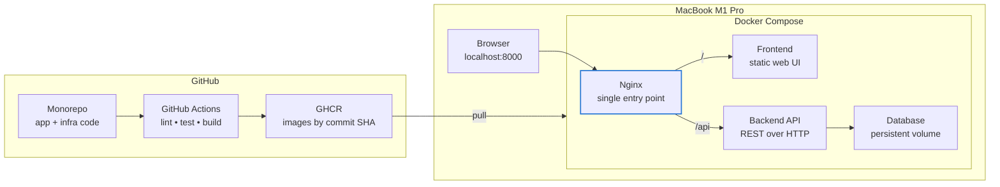

# Linkbox: DevOps Engineering & Architecture Documentation

Linkbox is a full-stack internal bookmarking application designed for developers to save, list, and organize links. This repository is structured as a robust, reproducible monorepo satisfying the core requirements of a DevOps-first architecture. It features a compiled high-performance Go REST API, a modern React + TypeScript + Vite frontend, and a PostgreSQL database—all fully containerized and orchestrated via Docker Compose, fronted by Nginx.

---

## 🚀 Quick Start (Running the Stack)

Follow these steps to run the complete, reproducible environment on your local machine.

### 📋 Prerequisites
Ensure you have the following installed on your machine:
*   **Docker Desktop** (or alternative runtimes like **OrbStack** or **Colima** with Docker Compose).
*   **Git** for cloning and source control.

### 🛠️ Setup & Running

1.  **Clone the Repository:**
    ```bash
    git clone https://github.com/WilsonAlmonte/link_box.git
    cd link_box
    ```

2.  **Configure Environment Variables:**
    Copy the provided `.env.example` template at the root directory to create your local `.env` configuration:
    ```bash
    cp .env.example .env
    ```
    *Note: The `.env` file is untracked by Git to protect secrets.*

3.  **Launch the Environment:**
    Build and start all services in the background:
    ```bash
    docker compose up --build -d
    ```
    *Note: If pulling pre-built images from GHCR (once your CI pipeline is set up), simply omit the `--build` flag.*

4.  **Access the Application:**
    Open your browser and navigate to:
    👉 **[http://localhost:8000](http://localhost:8000)**

5.  **View Logs:**
    To inspect aggregated logs from all services in real time:
    ```bash
    docker compose logs -f
    ```

6.  **Stop the Environment:**
    Tear down the stack while keeping your data safe:
    ```bash
    docker compose down
    ```
    To completely wipe the database volume and reset the environment:
    ```bash
    docker compose down -v
    ```

---

## 🧪 Testing and Linting

Each component includes automated testing and linting tools to maintain quality.

### Backend (Go API)
*   **Run Lint & Formatting Checks:**
    ```bash
    cd api
    go fmt ./... && go vet ./...
    ```
*   **Run Automated Tests:**
    ```bash
    cd api
    go test -v ./...
    ```

### Frontend (React Web App)
*   **Run Lint & Code Quality Checks:**
    ```bash
    cd web
    pnpm run lint
    ```
*   **Run Automated Tests:**
    ```bash
    cd web
    pnpm run test
    ```
*   **Run Static Type Checks & Build Compilation:**
    ```bash
    cd web
    pnpm run build
    ```

---

## 📐 Architecture & Decisions

Our architectural decisions focus on keeping the stack extremely lightweight, reliable, fast-building, and production-ready. Below is the comprehensive rationale behind every major design choice.



### 1. Languages and Frameworks
*   **Decision:** Go (`net/http` + SQLC) for the API; React + TypeScript + Vite for the web frontend.
*   **Alternatives Considered:** Node.js/Express, Python/FastAPI.
*   **Why Go?** Go compiles to a single, statically-linked binary with zero external runtime dependencies. This translates to **sub-20MB container images** and **sub-millisecond startup times**. It has a significantly smaller memory footprint than Node or Python.
*   **Why React + Vite?** Vite offers lightning-fast builds using native ES modules during development and ultra-optimized Rollup bundles for production, resulting in instant feedback loops and minimal load times.

### 2. Database & Schema Migrations
*   **Decision:** **PostgreSQL 16** (`alpine` variant) for persistence, with migrations managed by **Tern** in a dedicated short-lived migration container.
*   **Alternatives Considered:** SQLite, MySQL, or performing migrations inside the API container on startup.
*   **Why Tern?** Tern allows writing pure SQL migrations without compiling Go code or pulling massive migration frameworks into the production API image.
*   **Why a Separate Migration Container?** Performing migrations inside a dedicated ephemeral container (`migrate`) ensures strict orchestration:
    1.  The database starts and runs a healthcheck.
    2.  The `migrate` container runs, executes the SQL files, and exits cleanly.
    3.  The `api` container launches *only* after migrations succeed.
    This guarantees that if you scale your API to multiple replicas in production, there are no race conditions where multiple API instances try to alter the schema simultaneously.

### 3. Base Images
*   **Decision:** Multi-stage Docker builds utilizing `golang:1.27.1-alpine` and `node:24-alpine` for building, and minimal `alpine:3.20` for running.
*   **Alternatives Considered:** `ubuntu`, `debian-slim`, `distroless`.
*   **Why Alpine?** Alpine Linux is extremely lightweight (~5MB base size), keeping our final images exceptionally small. It compiles natively on `arm64` (Apple Silicon) without any emulation layers. For debuggability, Alpine includes `sh` and `apk` for quick diagnostics, providing the perfect middle ground between security/size (like `distroless`) and ease-of-use.

### 4. How the Frontend is Served
*   **Decision:** The frontend is compiled to static assets at build time, copied into a shared named Docker volume (`web_dist`), and the container exits (`service_completed_successfully`). **Nginx** mounts this volume as read-only and serves the static files.
*   **Alternatives Considered:** Serving static assets from a running Node.js/Express server or bundling them inside the API binary.
*   **Why this approach?** It completely removes Node.js and package runtimes from the production environment. Nginx is exceptionally fast at serving static assets, using almost zero CPU and memory. Rebuilding the frontend only updates the static files—never demanding a running runtime container.

### 5. Nginx Role
*   **Decision:** Nginx acts as both the static file server for the React frontend and a reverse proxy for the Go API.
*   **Why?**
    *   **Unified Entry Point:** Exposes exactly one port (`8000`) to the host.
    *   **No CORS Issues:** Since Nginx serves the web app on `/` and proxies the API on `/api/`, the browser perceives them as the same origin, eliminating complex CORS configurations.
    *   **Secure Isolation:** The backend API and PostgreSQL containers do not publish ports to the host; they communicate securely over the internal Docker network, reachable *only* through Nginx.

### 6. Configuration & Secrets Management
*   **Decision:** Store configuration in environment variables, populated via a local uncommitted `.env` file matching `.env.example`.
*   **Why?** This adheres to 12-Factor App methodology. It prevents sensitive information (like PostgreSQL passwords) from being checked into Git history, while giving developers a single file to configure ports, credentials, and settings.

---

## 🛠️ Troubleshooting Guide

Here are the three most common local failures and how to quickly resolve them:

### 1. Port 8000 is Already in Use
*   **Symptom:** Running `docker compose up` fails with:
    `Error response from daemon: Ports are not available: exposing port TCP 0.0.0.0:8000 failed`
*   **Why:** Another service on your Mac is already listening on port 8000.
*   **Solution:** Open your `.env` file (or `compose.yaml`) and update the mapped host port for Nginx from `"8000:80"` to an unused port, such as `"8080:80"`.

### 2. Migration Container Fails to Connect
*   **Symptom:** The `migrate` container continuously fails with timeout or connection errors, and the `api` container stays in a "Dependency failed" state.
*   **Why:** PostgreSQL is still initializing its storage directory and is not ready to accept connections when Tern attempts to migrate.
*   **Solution:** We have integrated robust healthchecks in `compose.yaml` utilizing `pg_isready` (with 10 retries). If it still fails, manually restart the database and migration steps:
    ```bash
    docker compose restart db
    docker compose up migrate
    ```

### 3. White Screen or "API Error" in Browser
*   **Symptom:** The webpage loads successfully but displays "API connection failed" or a generic API error.
*   **Why:** The frontend static assets were built with incorrect `VITE_API_URL` values, or the Go backend cannot connect to the database.
*   **Solution:** 
    1.  Verify that your `.env` file is populated with valid database and API configuration strings.
    2.  Check backend API logs: `docker compose logs api`.
    3.  If configurations were updated, force a clean rebuild of the static assets to inject the new env variables:
        ```bash
        docker compose up -d --build web
        ```

---

## 🔮 What to Do Next (Production Roadmap)

To transition this proof-of-concept stack to a highly available, secure production environment, the following improvements would be prioritized:

1.  **SSL/TLS Termination:**
    Configure Nginx to enforce HTTPS, terminate SSL/TLS certificates, and configure HTTP/2 for performance. In cloud environments, offload this to an AWS Application Load Balancer (ALB) or Cloudflare with automated Let's Encrypt certificates.
2.  **External Secrets Management:**
    Transition from plain `.env` files to cloud-native secret managers (such as AWS Secrets Manager, HashiCorp Vault, or GCP Secret Manager) to securely inject database credentials at runtime without exposing them on disk.
3.  **Horizontal Scaling & High Availability:**
    *   Scale the stateless `api` container to multiple replicas behind the Nginx load balancer.
    *   Transition PostgreSQL to a managed cloud database (e.g., AWS RDS PostgreSQL) with multi-AZ replication, automatic backups, and automated failover.
4.  **Production Nginx Optimizations:**
    *   Enable **Gzip/Brotli compression** for assets to decrease load times.
    *   Implement **caching headers** (`Cache-Control: public, max-age=31536000`) for static JS/CSS files since Vite includes content hashes.
    *   Configure security headers (`Content-Security-Policy`, `X-Frame-Options`, `X-Content-Type-Options`).
5.  **Robust Logging & Observability:**
    *   Replace standard stdout console logs with structured JSON logs in the Go API.
    *   Integrate a monitoring stack: Prometheus for gathering metrics, Grafana for visualization, and Loki/ELK for centralized log aggregation.
